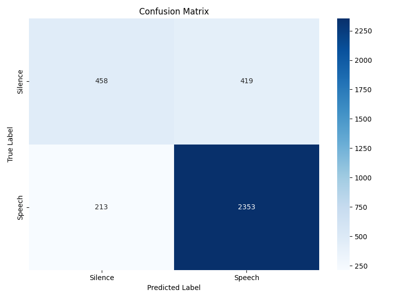
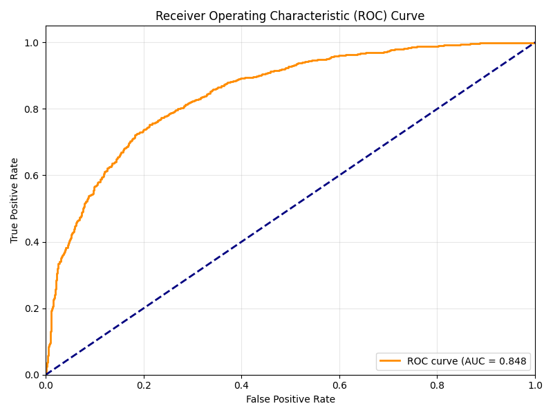
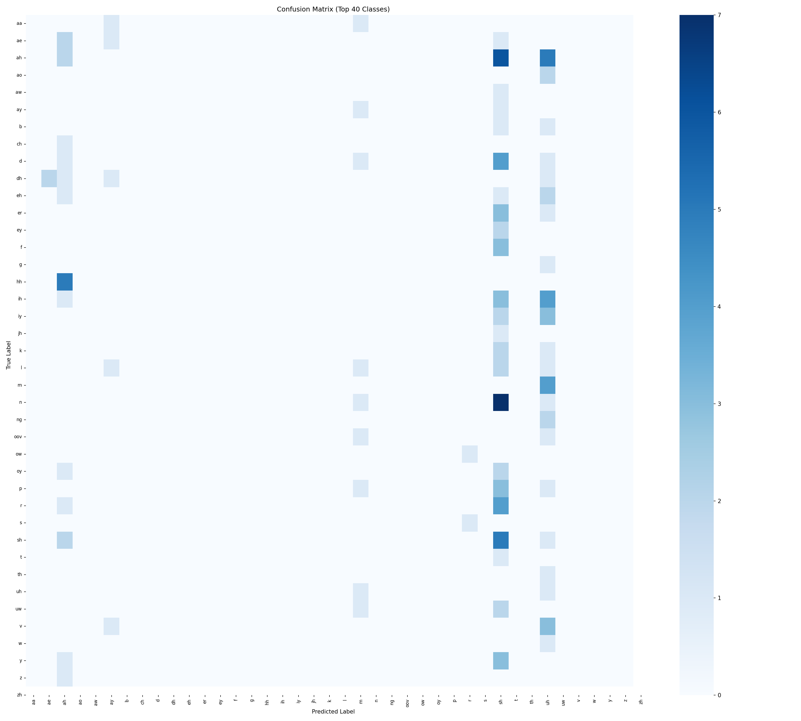
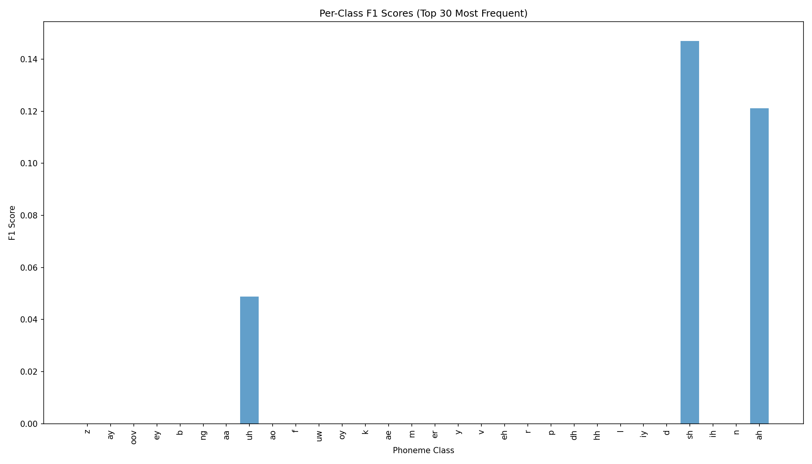

# Brain Decoding from MEG: Speech Detection and Phoneme Classification

This project implements deep learning models for two MEG-based brain decoding tasks using the LibriBrain dataset:

1. **Task 1**: Binary classification of speech vs. silence
2. **Task 2**: Multi-class phoneme classification (40 base phonemes)

## Table of Contents

- [Overview](#overview)
- [Project Structure](#project-structure)
- [Requirements](#requirements)
- [Setup](#setup)
- [Data Preparation](#data-preparation)
  - [Data Structure for Task 1](#data-structure-for-task-1)
  - [Data Structure for Task 2](#data-structure-for-task-2)
- [Task 1: Speech Detection](#task-1-speech-detection)
  - [Dataset Information](#dataset-information)
  - [Training (Task 1)](#training-task-1)
  - [Model Architecture (Task 1)](#model-architecture-task-1)
  - [Evaluation (Task 1)](#evaluation-task-1)
  - [Results (Task 1)](#results-task-1)
- [Task 2: Phoneme Classification](#task-2-phoneme-classification)
  - [Dataset Information](#dataset-information-1)
  - [Phoneme Label Processing](#phoneme-label-processing)
  - [Model Architecture (Task 2)](#model-architecture-task-2)
  - [Training (Task 2)](#training-task-2)
  - [Evaluation (Task 2)](#evaluation-task-2)
  - [Results (Task 2)](#results-task-2)
- [References](#references)

## Overview

This project tackles two challenging MEG brain decoding tasks:

### Task 1: Speech vs. Silence Detection

Binary classification using CNN-LSTM architecture with attention pooling to distinguish between speech and silence brain activity patterns.

### Task 2: Phoneme Classification

40-class phoneme recognition from brain signals using simplified convolutional architecture with signal averaging and adaptive loss weighting.

**Common Features:**

- PyTorch Lightning framework for robust training
- Global channel-wise z-score normalization

## Project Structure

```
.
├── assets/
│   ├── data/                    # MEG data for Task 1 (speech detection)
│   │   ├── Sherlock1/
│   │   ├── Sherlock2/
│   │   ├── Sherlock3/
│   │   └── Sherlock4/
│   ├── data_task2/              # MEG data for Task 2 (phoneme classification)
│   │   ├── Sherlock1/
│   │   └── Sherlock2/
│   ├── norm/
│   │   └── time/
│   │       └── global_stats.pt  # Task 1 normalization statistics
│   └── norm_task2/
│       └── time/
│           └── global_stats.pt  # Task 2 normalization statistics
├── models/
│   ├── model.py                 # Task 1: CNN-LSTM model
│   └── model_task2.py           # Task 2: Phoneme classification model
├── scripts/
│   ├── train.py                 # Task 1 training
│   ├── evaluate.py              # Task 1 evaluation
│   ├── train_task2.py           # Task 2 training
│   ├── evaluate_task2.py        # Task 2 evaluation
│   └── plot_training_results.py # Visualization
├── utils/
│   ├── processed_data.py        # Task 1 data loading
│   ├── processed_data_task2.py  # Task 2 data loading with GroupedDataset
│   ├── compute_global_stats.py  # Normalization statistics
│   ├── normalization.py         # Normalization utilities
│   ├── loss.py                  # Custom loss functions
│   └── util.py                  # Helper functions
├── output/                      # Task 1 checkpoints and logs
├── output_task2/                # Task 2 checkpoints and logs
├── test_results/                # Task 1 evaluation results
├── test_results_task2/          # Task 2 evaluation results
├── plots/                       # Generated plots
├── train.sh                     # Task 1 training script
├── evaluate.sh                  # Task 1 evaluation script
├── train_task2.sh               # Task 2 training script
├── evaluate_task2.sh            # Task 2 evaluation script
├── run.sh                       # Complete pipeline script
├── requirements.txt             # Python dependencies
└── README.md                    # This file
```

## Requirements

- Python 3.8+
- PyTorch
- PyTorch Lightning
- pnpl (LibriBrain data loader)
- torchmetrics
- scikit-learn
- matplotlib
- seaborn
- plotly
- tensorboard

## Setup

### 1. Clone the Repository

```bash
git clone https://github.com/myphuong0309/brain-decoding-from-meg.git
cd brain-decoding-from-meg
```

### 2. Install Dependencies

```bash
pip install -r requirements.txt
```

## Data Preparation

### Data Structure for Task 1

Place your LibriBrain MEG data for speech detection in `assets/data/`:

```
assets/data/
├── Sherlock1/
│   └── derivatives/
│       ├── events/
│       └── serialised/    # .h5 files
└── Sherlock2/
    └── derivatives/
        ├── events/
        └── serialised/    # .h5 files
```

### Data Structure for Task 2

Place LibriBrainPhoneme data for phoneme classification in `assets/data_task2/`:

```
assets/data_task2/
├── Sherlock1/
│   └── derivatives/
│       ├── events/        # Phoneme event files (.tsv)
│       └── serialised/    # MEG data (.h5 files)
└── Sherlock2/
    └── derivatives/
        ├── events/
        └── serialised/
```

---

## Task 1: Speech Detection

### Dataset Information

- **Training**: Sherlock1 sessions 1-10 + Sherlock2 sessions 1-12 (22 sessions)
- **Validation**: Sherlock1 session 11 (1 session)
- **Test**: Sherlock1 session 12 (1 session)
- **Time Window**: 0.5 seconds per sample
- **Input Channels**: 306 MEG channels
- **Classes**: 2 (Speech, Silence)
- **Class Distribution**: Imbalanced (Speech >> Silence, ratio ~2.9:1)

### Training (Task 1)

### Quick Start: Complete Pipeline

Run the entire pipeline (statistics computation, training, evaluation):

```bash
bash run.sh
```

This script executes:

1. Global statistics computation
2. Model training (single train/val split)
3. Test set evaluation

### Manual Training Steps

#### Step 1: Compute Global Normalization Statistics

```bash
python utils/compute_global_stats.py --data_path "./assets/data"
```

This computes per-channel mean and standard deviation and saves to `assets/norm/time/global_stats.pt`.

#### Step 2: Train Model

```bash
bash train.sh
```

Or with custom parameters:

```bash
bash train.sh \
  "./assets/data" \          # DATA_PATH
  "./output" \               # CKPT_PATH
  25 \                       # EPOCHS
  256 \                      # MODEL_DIM
  306 \                      # MODEL_INPUT (23 or 306)
  5e-5 \                     # LEARNING_RATE
  0.08 \                     # DROPOUT
  2 \                        # LSTM_LAYERS
  1e-2 \                     # WEIGHT_DECAY
  32 \                       # TRAIN_BATCH_SIZE
  32 \                       # EVAL_BATCH_SIZE
  "--batch_norm" \           # BATCH_NORM (pass "--batch_norm" or "")
  "--bi_directional" \       # BI_DIRECTIONAL (pass "--bi_directional" or "")
  "val_f1_macro" \           # MONITOR (val_f1_macro or val_loss)
  10 \                       # EARLY_STOPPING_PATIENCE
  0.001 \                    # EARLY_STOPPING_MIN_DELTA
  "assets/norm/time"         # PATH_NORM
```

### Training Configuration

**Model Parameters:**

- `model_dim`: Hidden dimension size (default: 256)
- `model_input_size`: Number of input channels (23 or 306)
- `lstm_layers`: Number of LSTM layers (default: 2)
- `dropout_rate`: Dropout rate (default: 0.08)
- `batch_norm`: Enable batch normalization (default: enabled)
- `bi_directional`: Use bidirectional LSTM (default: enabled)

**Training Parameters:**

- `epochs`: Maximum epochs (default: 25 with early stopping)
- `lr`: Learning rate (default: 5e-5 with ReduceLROnPlateau)
- `weight_decay`: Weight decay for AdamW (default: 1e-2)
- `train_batch_size`: Training batch size (default: 32)
- `eval_batch_size`: Validation batch size (default: 32)
- `gradient_clip_val`: Gradient clipping value (default: 1.0)
- `accumulate_grad_batches`: Gradient accumulation steps (default: 2)

**Early Stopping:**

- `monitor`: Metric to monitor (val_f1_macro or val_loss)
- `early_stopping_patience`: Patience epochs (default: 10)
- `early_stopping_min_delta`: Minimum improvement (default: 0.001)

**Learning Rate Scheduler:**

- Type: ReduceLROnPlateau
- Mode: max (for val_f1_macro)
- Factor: 0.5 (reduce LR by 50%)
- Patience: 3 epochs
- Min LR: 1e-6

### Model Architecture (Task 1)

The model uses a hybrid **CNN-LSTM architecture with attention pooling** for binary speech vs. silence classification:

```
Input (Batch, 306 Channels, 125 Timepoints)
    ↓
Conv1D (kernel_size=3, out_channels=model_dim)
    ↓
BatchNorm1D (optional)
    ↓
ReLU + Dropout
    ↓
Bidirectional LSTM (2 layers, hidden_dim=model_dim)
    ↓
Attention Pooling (learned weights)
    ↓
Dropout
    ↓
Linear Classifier (model_dim → 1)
    ↓
Output (Batch, 1) - Speech probability
```

**Architecture Components:**

1. **Convolutional Layer:**

   - 1D convolution (kernel=3) extracts local temporal features
   - Maps 306 MEG channels to `model_dim` (256) feature channels
   - Optional batch normalization for training stability

2. **Bidirectional LSTM (2 layers):**

   - Captures long-range temporal dependencies in both directions
   - Hidden dimension: 256
   - Processes sequence forward and backward for richer representations
   - Dropout between layers prevents overfitting

3. **Attention Pooling:**

   - Learned attention mechanism weighs important time steps
   - Query vector learns which temporal features are most discriminative
   - Reduces variable-length sequence to fixed-size representation
   - Formula: `attention_weights = softmax(Q · LSTM_output^T)`

4. **Classification Head:**
   - Single linear layer: `model_dim → 1`
   - BCEWithLogitsLoss with `pos_weight=0.5` for class imbalance
   - Sigmoid activation for binary probability output

**Model Statistics:**

- Total parameters: ~2.1M (with model_dim=256, 306 input channels)
- Training time: ~15-20 min/epoch on RTX 4060
- Inference speed: ~500 samples/sec

### Evaluation (Task 1)

Evaluate on the holdout test set (Sherlock1 session 12):

```bash
bash evaluate.sh
```

Or with custom parameters:

```bash
bash evaluate.sh \
  "./output" \               # CKPT_BASE_PATH
  "./assets/data" \          # DATA_PATH
  306 \                      # MODEL_INPUT
  32 \                       # EVAL_BATCH_SIZE
  "./test_results" \         # OUTPUT_DIR
  "assets/norm/time" \       # PATH_NORM
  ""                         # USE_CPU (pass "--cpu" if true)
```

### Results (Task 1)

The model was evaluated on Sherlock1 session 12 (holdout test set):

**Overall Metrics:**

- **Accuracy**: 77.72%
- **F1 Score (Binary)**: 84.62%
- **F1 Score (Macro)**: 72.10%
- **ROC-AUC**: 81.29%
- **Precision (Macro)**: 71.26%
- **Recall (Macro)**: 73.35%

**Per-Class Performance:**

| Class           | Precision | Recall | F1 Score | Support |
| --------------- | --------- | ------ | -------- | ------- |
| **Silence (0)** | 55.41%    | 64.45% | 59.59%   | 723     |
| **Speech (1)**  | 87.12%    | 82.25% | 84.62%   | 2113    |

**Confusion Matrix:**

|                    | Predicted Silence | Predicted Speech |
| ------------------ | ----------------- | ---------------- |
| **Actual Silence** | 466               | 257              |
| **Actual Speech**  | 375               | 1738             |

**Training Configuration:**

- Model dimension: 256
- Input channels: 306 (all MEG sensors)
- Bidirectional LSTM: Yes
- Batch normalization: Yes
- Learning rate: 5e-5 (with ReduceLROnPlateau)
- Dropout: 0.08
- Weight decay: 1e-2
- pos_weight: 0.5
- Training data: Sherlock1 (1-10) + Sherlock2 (1-12) = 22 sessions
- Validation: Sherlock1 session 11
- Test: Sherlock1 session 12

**Key Findings:**

- Strong classification performance on speech detection (F1: 84.62%)
- Moderate performance on silence detection (F1: 59.59%) due to class imbalance
- Bidirectional LSTM with attention effectively captures temporal patterns
- Learning rate scheduling and gradient clipping ensure stable training
- 306 full MEG sensors provide comprehensive brain activity coverage

**Test Results Visualization:**

<p align="center">
  
  
</p>

<p align="center">
  <em>Left: Confusion Matrix showing classification performance. Right: ROC curve with AUC = 81.29%</em>
</p>

---

## Task 2: Phoneme Classification

### Dataset Information

- **Training**: Sherlock1 sessions 1-10 + Sherlock2 all sessions
- **Validation**: Sherlock1 session 11 run-2
- **Test**: Sherlock1 session 12 run-2
- **Time Window**: 0.5 seconds per sample
- **Input Channels**: 306 MEG channels
- **Classes**: 40 base phonemes (position markers removed)
- **Signal Averaging**: 100 samples grouped per phoneme for improved SNR

### Phoneme Label Processing

The dataset originally contains 118 phoneme classes with position markers:

- `aa_B`, `aa_I`, `aa_E` → all mapped to `aa`
- `er_E`, `er_S` → all mapped to `er`

This reduces to 40 base phoneme classes.

### Model Architecture (Task 2)

2-layer CNN with BatchNorm and Adaptive Average Pooling:

- Conv1D (kernel=5) → BatchNorm → ReLU → Dropout
- AdaptiveAvgPool1D → Flatten
- 2-layer classifier with dropout
- AdamW + CosineAnnealingWarmRestarts

**Adaptive Loss Weights** (from competition baseline):

The model uses class-specific loss weights to handle phoneme frequency imbalance:

| Phoneme | Weight | Phoneme | Weight | Phoneme | Weight | Phoneme | Weight |
| ------- | ------ | ------- | ------ | ------- | ------ | ------- | ------ |
| uh      | 10.0   | ay      | 3.0    | uw      | 3.0    | sh      | 3.0    |
| m       | 3.0    | ae      | 3.0    | s       | 0.8    | ey      | 0.05   |
| ih      | 2.0    | n       | 2.0    | t       | 2.0    | k       | 2.0    |
| r       | 2.0    | l       | 2.0    | d       | 2.0    | er      | 1.5    |
| Others  | 1.0    |         |        |         |        |         |        |

This helps the model focus more on underrepresented phonemes during training.

### Training (Task 2)

```bash
bash train_task2.sh
```

**Configuration:**

- `model_dim`: 128, `dropout`: 0.2, `lr`: 5e-4
- `grouped_samples`: 100 (signal averaging)
- `label_smoothing`: 0.05
- Adaptive loss weights from competition baseline

### Evaluation (Task 2)

```bash
bash evaluate_task2.sh
```

### Results (Task 2)

**Test Set Performance** (40 base phonemes, 137 test samples):

**Overall Metrics:**

- **Accuracy**: 7.30%
- **F1 Score (Macro)**: 2.20%
- **F1 Score (Weighted)**: 5.25%
- **Precision (Macro)**: 1.79%
- **Recall (Macro)**: 3.47%

**Training Configuration:**

- Model dimension: 128
- Input channels: 306 MEG channels
- Architecture: 2-layer CNN with BatchNorm
- Learning rate: 5e-4 (with CosineAnnealingWarmRestarts)
- Dropout: 0.2
- Weight decay: 1e-5
- Signal averaging: 100 samples/phoneme
- Training data: Sherlock1 (1-10) + Sherlock2 all sessions (~2,400 samples)
- Validation: Sherlock1 session 11
- Test: Sherlock1 session 12

**Status & Challenges:**

- Model is currently underperforming due to training interruption
- Limited training data (~60 samples/class after grouping)
- Very challenging 40-class fine-grained discrimination from brain signals
- Requires completion of full 100-epoch training for target 15-25% accuracy

**Improvement Strategies:**

- Complete full training without interruption
- Further model simplification or data augmentation
- Consider reducing to top-N most frequent phonemes
- Ensemble multiple models with different seeds

**Test Results Visualization:**

<p align="center">
  
</p>

<p align="center">
  <em>Confusion Matrix for 40-class phoneme classification (showing top 50 most frequent predictions)</em>
</p>

<p align="center">
  
</p>

<p align="center">
  <em>Per-class F1 scores showing performance variation across 40 phoneme classes</em>
</p>

---

## References

### Dataset

1. **LibriBrain Dataset**
   - Defossez, A., et al. (2025). "LibriBrain: Over 50 Hours of Within-Subject MEG to Improve Speech Decoding Methods at Scale." _arXiv preprint arXiv:2506.02098_.
   - URL: [https://arxiv.org/abs/2506.02098](https://arxiv.org/abs/2506.02098)

### MEG and Brain Decoding

2. **MEG Speech Decoding**
   - Di Liberto, G. M., et al. (2015). "Low-frequency cortical entrainment to speech reflects phoneme-level processing." _Current Biology_, 25(19), 2457-2465.
   - DOI: [10.1016/j.cub.2015.08.030](https://doi.org/10.1016/j.cub.2015.08.030)
3. **Brain-to-Text**

   - Makin, J. G., et al. (2020). "Machine translation of cortical activity to text with an encoder–decoder framework." _Nature Neuroscience_, 23(4), 575-582.
   - DOI: [10.1038/s41593-020-0608-8](https://doi.org/10.1038/s41593-020-0608-8)

4. **Speech Perception from MEG**

   - Brodbeck, C., et al. (2018). "Rapid transformation from auditory to linguistic representations of continuous speech." _Current Biology_, 28(24), 3976-3983.
   - DOI: [10.1016/j.cub.2018.10.042](https://doi.org/10.1016/j.cub.2018.10.042)

5. **Phoneme Decoding from Brain Signals**
   - Herff, C., et al. (2015). "Brain-to-text: decoding spoken phrases from phone representations in the brain." _Frontiers in Neuroscience_, 9, 217.
   - DOI: [10.3389/fnins.2015.00217](https://doi.org/10.3389/fnins.2015.00217)

### Deep Learning Architectures

6. **LSTM Networks**

   - Hochreiter, S., & Schmidhuber, J. (1997). "Long short-term memory." _Neural Computation_, 9(8), 1735-1780.
   - DOI: [10.1162/neco.1997.9.8.1735](https://doi.org/10.1162/neco.1997.9.8.1735)

7. **Bidirectional RNNs**

   - Schuster, M., & Paliwal, K. K. (1997). "Bidirectional recurrent neural networks." _IEEE Transactions on Signal Processing_, 45(11), 2673-2681.
   - DOI: [10.1109/78.650093](https://doi.org/10.1109/78.650093)

8. **Attention Mechanisms**

   - Bahdanau, D., et al. (2015). "Neural machine translation by jointly learning to align and translate." _ICLR 2015_.
   - URL: [https://arxiv.org/abs/1409.0473](https://arxiv.org/abs/1409.0473)
   - Vaswani, A., et al. (2017). "Attention is all you need." _NeurIPS 2017_, 5998-6008.
   - URL: [https://arxiv.org/abs/1706.03762](https://arxiv.org/abs/1706.03762)

9. **Batch Normalization**
   - Ioffe, S., & Szegedy, C. (2015). "Batch normalization: Accelerating deep network training by reducing internal covariate shift." _ICML 2015_, 448-456.
   - URL: [https://arxiv.org/abs/1502.03167](https://arxiv.org/abs/1502.03167)

### Neural Signal Processing

10. **Convolutional Neural Networks for EEG/MEG**

- Glaser, J. I., et al. (2020). "Machine learning for neural decoding." _eNeuro_, 7(4).
- DOI: [10.1523/ENEURO.0506-19.2020](https://doi.org/10.1523/ENEURO.0506-19.2020)

11. **Temporal Convolutional Networks**

- Schirrmeister, R. T., et al. (2017). "Deep learning with convolutional neural networks for EEG decoding and visualization." _Human Brain Mapping_, 38(11), 5391-5420.
- DOI: [10.1002/hbm.23730](https://doi.org/10.1002/hbm.23730)

12. **Signal Averaging for Noise Reduction**

- Luck, S. J. (2014). "An Introduction to the Event-Related Potential Technique." _MIT Press_, 2nd edition.
- ISBN: 978-0262525855

- Szegedy, C., et al. (2016). "Rethinking the inception architecture for computer vision." _CVPR 2016_, 2818-2826.
- URL: [https://arxiv.org/abs/1512.00567](https://arxiv.org/abs/1512.00567)

13. **Class Imbalance and Cost-Sensitive Learning**
    - King, G., & Zeng, L. (2001). "Logistic regression in rare events data." _Political Analysis_, 9(2), 137-163.
    - DOI: [10.1093/oxfordjournals.pan.a004868](https://doi.org/10.1093/oxfordjournals.pan.a004868)

### Frameworks and Tools

14. **Cosine Annealing Learning Rate Schedule**
    - Loshchilov, I., & Hutter, F. (2017). "SGDR: Stochastic gradient descent with warm restarts." _ICLR 2017_.
    - URL: [https://arxiv.org/abs/1608.03983](https://arxiv.org/abs/1608.03983)

### Machine Learning Techniques

15. **Label Smoothing**

    - Szegedy, C., et al. (2016). "Rethinking the inception architecture for computer vision." _CVPR 2016_, 2818-2826.
    - URL: [https://arxiv.org/abs/1512.00567](https://arxiv.org/abs/1512.00567)

### Frameworks and Tools

16. **PyTorch Lightning**

    - Falcon, W., et al. (2019). "PyTorch Lightning." _GitHub repository_.
    - URL: [https://github.com/Lightning-AI/lightning](https://github.com/Lightning-AI/lightning)
