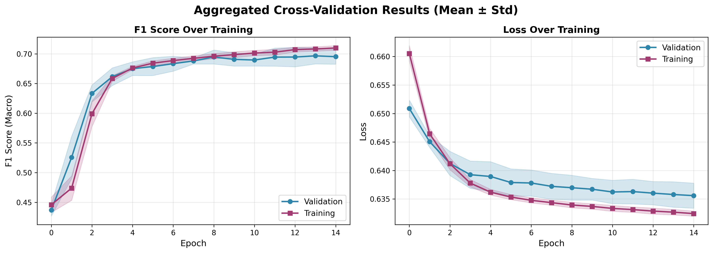
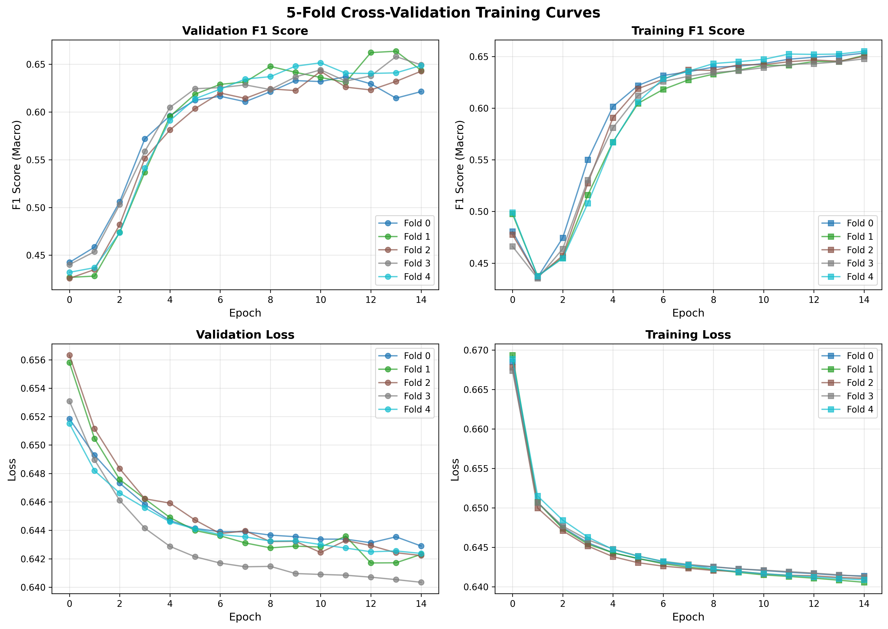

# Brain Decoding from MEG: Speech vs. Silence Classification

This project implements a deep learning model for classifying speech versus silence from MEG (Magnetoencephalography) brain recordings using the LibriBrain dataset.

## Table of Contents

- [Overview](#overview)
- [Project Structure](#project-structure)
- [Requirements](#requirements)
- [Setup](#setup)
- [Data Preparation](#data-preparation)
- [Training](#training)
- [Evaluation](#evaluation)
- [Visualization](#visualization)
- [Model Architecture](#model-architecture)
- [Results](#results)

## Overview

This project uses MEG recordings from the LibriBrain dataset (Sherlock1 and Sherlock2 sessions) to classify brain activity as either speech or silence. The model employs a CNN-LSTM architecture with attention pooling for temporal feature extraction.

**Key Features:**

- Deep learning model with Conv1D + Bi-LSTM + Attention mechanism
- 5-fold or 10-fold cross-validation
- Global channel-wise z-score normalization
- Early stopping with configurable patience
- Comprehensive evaluation metrics (F1, Precision, Recall, ROC-AUC)
- Ensemble prediction from multiple folds
- Training visualization and analysis tools

## Project Structure

```
.
├── assets/
│   ├── data/                    # MEG data directory
│   │   ├── Sherlock1/
│   │   ├── Sherlock2/
│   │   └── cached_cv10/         # Precached fold splits
│   └── norm/
│       └── time/
│           └── global_stats.pt  # Global normalization statistics
├── models/
│   └── model.py                 # PyTorch Lightning model definition
├── scripts/
│   ├── train.py                 # Training script
│   ├── evaluate.py              # Evaluation script
│   └── plot_training_results.py # Visualization script
├── utils/
│   ├── folds.py                 # Data splitting and caching
│   ├── compute_global_stats.py  # Normalization statistics
│   ├── processed_data.py        # Data loading and preprocessing
│   ├── loss.py                  # Custom loss functions
│   ├── normalization.py         # Normalization utilities
│   └── util.py                  # Helper functions
├── output/                      # Training checkpoints and logs
├── test_results/                # Test set evaluation results
├── plots/                       # Generated plots
├── train.sh                     # Training wrapper script
├── evaluate.sh                  # Evaluation wrapper script
├── run.sh                       # Complete pipeline script
├── requirements.txt             # Python dependencies
└── README.md                    # This file
```

## Requirements

- Python 3.8+
- PyTorch
- PyTorch Lightning
- pnpl (LibriBrain data loader)
- torchmetrics
- scikit-learn
- matplotlib
- seaborn
- plotly
- tensorboard

## Setup

### 1. Clone the Repository

```bash
git clone https://github.com/myphuong0309/brain-decoding-from-meg.git
cd brain-decoding-from-meg
```

### 2. Install Dependencies

```bash
pip install -r requirements.txt
```

## Data Preparation

### Data Structure

Place your LibriBrain MEG data in `assets/data/` with the following structure:

```
assets/data/
├── Sherlock1/
│   └── derivatives/
│       ├── events/
│       └── serialised/    # .h5 files
└── Sherlock2/
    └── derivatives/
        ├── events/
        └── serialised/    # .h5 files
```

### Dataset Information

- **Training/Validation**: Sherlock1 sessions 1-10, Sherlock2 sessions 1-12
- **Test Set**: Sherlock1 sessions 11-12
- **Input Channels**:
  - Full MEG: 306 channels
  - Speech-specific: 23 selected channels

## Training

### Quick Start: Complete Pipeline

Run the entire pipeline (precaching, statistics, training, evaluation):

```bash
bash run.sh
```

This script executes:

1. Data precaching (10-fold splits)
2. Global statistics computation
3. Model training (5-fold cross-validation)
4. Test set evaluation (ensemble)

### Step-by-Step Training

#### Step 1: Precache Data Splits

```bash
python utils/folds.py --data_path "./assets/data" --n_splits 10
```

This creates cached PyTorch datasets for each fold in `assets/data/cached_cv10/`.

#### Step 2: Compute Global Normalization Statistics

```bash
python utils/compute_global_stats.py --data_path "./assets/data"
```

This computes per-channel mean and standard deviation and saves to `assets/norm/time/global_stats.pt`.

#### Step 3: Train Model

```bash
bash train.sh
```

Or with custom parameters:

```bash
bash train.sh \
  "./assets/data" \          # DATA_PATH
  "./output" \               # CKPT_PATH
  15 \                       # EPOCHS
  128 \                      # MODEL_DIM
  23 \                       # MODEL_INPUT (23 or 306)
  1e-5 \                     # LEARNING_RATE
  0.2 \                      # DROPOUT
  2 \                        # LSTM_LAYERS
  1e-5 \                     # WEIGHT_DECAY
  32 \                       # TRAIN_BATCH_SIZE
  32 \                       # EVAL_BATCH_SIZE
  "" \                       # BATCH_NORM (pass "--batch_norm" if true)
  "" \                       # BI_DIRECTIONAL (pass "--bi_directional" if true)
  5 \                        # N_SPLITS
  "val_f1_macro" \           # MONITOR (val_f1_macro or val_loss)
  10 \                       # EARLY_STOPPING_PATIENCE
  0.001 \                    # EARLY_STOPPING_MIN_DELTA
  "assets/norm/time"         # PATH_NORM
```

### Training Configuration

**Model Parameters:**

- `model_dim`: Hidden dimension size (default: 128)
- `model_input_size`: Number of input channels (23 or 306)
- `lstm_layers`: Number of LSTM layers (default: 2)
- `dropout_rate`: Dropout rate (default: 0.2)
- `batch_norm`: Enable batch normalization
- `bi_directional`: Use bidirectional LSTM

**Training Parameters:**

- `epochs`: Maximum epochs (default: 15)
- `lr`: Learning rate (default: 1e-5)
- `weight_decay`: Weight decay for AdamW (default: 1e-5)
- `train_batch_size`: Training batch size (default: 32)
- `eval_batch_size`: Validation batch size (default: 32)

**Cross-Validation:**

- `n_splits`: Number of folds (default: 5)

**Early Stopping:**

- `monitor`: Metric to monitor (val_f1_macro or val_loss)
- `early_stopping_patience`: Patience epochs (default: 10)
- `early_stopping_min_delta`: Minimum improvement (default: 0.001)

## Evaluation

### Test Set Evaluation (Ensemble)

Evaluate on the holdout test set using ensemble predictions from all folds:

```bash
bash evaluate.sh
```

Or with custom parameters:

```bash
bash evaluate.sh \
  "./output" \               # CKPT_BASE_PATH
  "./assets/data" \          # DATA_PATH
  23 \                       # MODEL_INPUT
  32 \                       # EVAL_BATCH_SIZE
  "./test_results" \         # OUTPUT_DIR
  "assets/norm/time" \       # PATH_NORM
  ""                         # USE_CPU (pass "--cpu" if true)
```

### Evaluation Outputs

Results are saved in `test_results/`:

- `metrics.json`: Complete evaluation metrics
- `confusion_matrix.png`: Confusion matrix visualization
- `roc_curve.png`: ROC curve with AUC score

**Metrics Computed:**

- Accuracy
- Precision, Recall, F1 (binary and macro-averaged)
- ROC-AUC
- Per-class metrics
- Confusion matrix

## Visualization

### Generate Training Plots

After training, visualize the results:

```bash
python scripts/plot_training_results.py \
  --output_dir "./output" \
  --timestamp "2025-11-15_18-46-12" \
  --save_dir "./plots"
```

### Generated Plots

1. **training_curves.png**: Individual fold training and validation curves

   - Shows F1 score and loss for each fold across epochs
   - Helps identify overfitting and fold consistency

2. **aggregated_curves.png**: Mean ± std across all folds

   - Aggregated view of model performance
   - Shaded areas represent standard deviation
   - Useful for understanding overall training dynamics

3. **fold_comparison.png**: Best performance comparison per fold
   - Bar chart comparing best metrics across folds
   - Shows fold-to-fold variability

## Model Architecture

### Overview

The model uses a hybrid CNN-LSTM architecture with attention pooling:

```
Input (B, C, T)
    ↓
Conv1D (kernel_size=3)
    ↓
BatchNorm (optional)
    ↓
Dropout
    ↓
Bi-LSTM (2 layers)
    ↓
Attention Pooling
    ↓
Dropout
    ↓
Linear Classifier
    ↓
Output (B, 1)
```

### Components

**1. Convolutional Layer:**

- 1D convolution with kernel size 3
- Extracts local temporal patterns
- Batch normalization (optional)

**2. Bidirectional LSTM:**

- Captures long-range temporal dependencies
- Bidirectional: processes sequence forward and backward
- 2 layers with dropout between layers

**3. Attention Pooling:**

- Learned attention mechanism
- Weights important time steps
- Reduces sequence to fixed-size representation

**4. Classification Head:**

- Single linear layer
- Binary classification (speech vs. silence)
- BCEWithLogitsLoss with label smoothing

### Loss Function

**BCEWithLogitsLoss with Label Smoothing:**

- Prevents overconfident predictions
- Smoothing parameter: 0.5 (default)
- Positive class weighting supported

## Results

### Training Results




The aggregated curves show:

- Training and validation F1 scores over epochs
- Training and validation losses over epochs
- Mean performance with standard deviation across folds
- Demonstrates model convergence and generalization

**Confusion Matrix and ROC Curve** are available in `test_results/`.

### Key Findings

- Strong classification performance on speech vs. silence task
- Ensemble approach improves generalization
- Attention mechanism helps focus on relevant temporal features
- 23 speech-specific sensors perform comparably to 306 full sensors

## References

### Dataset

1. **LibriBrain Dataset**
   - Defossez, A., et al. (2025). "LibriBrain: Over 50 Hours of Within-Subject MEG to Improve Speech Decoding Methods at Scale." _arXiv preprint arXiv:2506.02098_.
   - URL: [https://arxiv.org/abs/2506.02098](https://arxiv.org/abs/2506.02098)

### MEG and Brain Decoding

2. **MEG Speech Decoding**
   - Di Liberto, G. M., et al. (2015). "Low-frequency cortical entrainment to speech reflects phoneme-level processing." _Current Biology_, 25(19), 2457-2465.
   - DOI: [10.1016/j.cub.2015.08.030](https://doi.org/10.1016/j.cub.2015.08.030)
3. **Brain-to-Text**

   - Makin, J. G., et al. (2020). "Machine translation of cortical activity to text with an encoder–decoder framework." _Nature Neuroscience_, 23(4), 575-582.
   - DOI: [10.1038/s41593-020-0608-8](https://doi.org/10.1038/s41593-020-0608-8)

4. **Speech Perception from MEG**
   - Brodbeck, C., et al. (2018). "Rapid transformation from auditory to linguistic representations of continuous speech." _Current Biology_, 28(24), 3976-3983.
   - DOI: [10.1016/j.cub.2018.10.042](https://doi.org/10.1016/j.cub.2018.10.042)

### Deep Learning Architectures

5. **LSTM Networks**

   - Hochreiter, S., & Schmidhuber, J. (1997). "Long short-term memory." _Neural Computation_, 9(8), 1735-1780.
   - DOI: [10.1162/neco.1997.9.8.1735](https://doi.org/10.1162/neco.1997.9.8.1735)

6. **Bidirectional RNNs**

   - Schuster, M., & Paliwal, K. K. (1997). "Bidirectional recurrent neural networks." _IEEE Transactions on Signal Processing_, 45(11), 2673-2681.
   - DOI: [10.1109/78.650093](https://doi.org/10.1109/78.650093)

7. **Attention Mechanisms**
   - Bahdanau, D., et al. (2015). "Neural machine translation by jointly learning to align and translate." _ICLR 2015_.
   - URL: [https://arxiv.org/abs/1409.0473](https://arxiv.org/abs/1409.0473)
   - Vaswani, A., et al. (2017). "Attention is all you need." _NeurIPS 2017_, 5998-6008.
   - URL: [https://arxiv.org/abs/1706.03762](https://arxiv.org/abs/1706.03762)

### Neural Signal Processing

8. **Deep Learning for Neural Decoding**

   - Glaser, J. I., et al. (2020). "Machine learning for neural decoding." _eNeuro_, 7(4).
   - DOI: [10.1523/ENEURO.0506-19.2020](https://doi.org/10.1523/ENEURO.0506-19.2020)

9. **Convolutional Neural Networks for EEG/MEG**

   - Schirrmeister, R. T., et al. (2017). "Deep learning with convolutional neural networks for EEG decoding and visualization." _Human Brain Mapping_, 38(11), 5391-5420.
   - DOI: [10.1002/hbm.23730](https://doi.org/10.1002/hbm.23730)

10. **Temporal Convolutional Networks**
    - Lea, C., et al. (2017). "Temporal convolutional networks for action segmentation and detection." _CVPR 2017_, 156-165.
    - URL: [https://arxiv.org/abs/1611.05267](https://arxiv.org/abs/1611.05267)

### Machine Learning Techniques

11. **Label Smoothing**

    - Szegedy, C., et al. (2016). "Rethinking the inception architecture for computer vision." _CVPR 2016_, 2818-2826.
    - URL: [https://arxiv.org/abs/1512.00567](https://arxiv.org/abs/1512.00567)

12. **Cross-Validation**
    - Kohavi, R. (1995). "A study of cross-validation and bootstrap for accuracy estimation and model selection." _IJCAI_, 14(2), 1137-1145.
    - URL: [https://www.ijcai.org/Proceedings/95-2/Papers/016.pdf](https://www.ijcai.org/Proceedings/95-2/Papers/016.pdf)

### Frameworks and Tools

13. **PyTorch Lightning**

    - Falcon, W., et al. (2019). "PyTorch Lightning." _GitHub repository_.
    - URL: [https://github.com/Lightning-AI/lightning](https://github.com/Lightning-AI/lightning)

14. **PyTorch**
    - Paszke, A., et al. (2019). "PyTorch: An imperative style, high-performance deep learning library." _NeurIPS 2019_, 8024-8035.
    - URL: [https://arxiv.org/abs/1912.01703](https://arxiv.org/abs/1912.01703)
