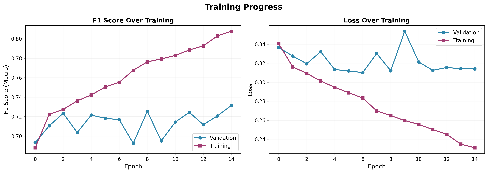

# Brain Decoding from MEG: Speech vs. Silence Classification

This project implements a deep learning model for classifying speech versus silence from MEG (Magnetoencephalography) brain recordings using the LibriBrain dataset.

## Table of Contents

- [Overview](#overview)
- [Project Structure](#project-structure)
- [Requirements](#requirements)
- [Setup](#setup)
- [Data Preparation](#data-preparation)
- [Training](#training)
- [Evaluation](#evaluation)
- [Visualization](#visualization)
- [Model Architecture](#model-architecture)
- [Results](#results)
- [References](#references)

## Overview

This project uses MEG recordings from the LibriBrain dataset to classify brain activity as either speech or silence. The model employs a CNN-LSTM architecture with attention pooling for temporal feature extraction.

**Key Features:**

- Deep learning model with Conv1D + Bi-LSTM + Attention mechanism
- Fixed train/validation/test split for robust evaluation
- Global channel-wise z-score normalization
- Learning rate scheduling and gradient clipping for stable training
- Comprehensive evaluation metrics (F1, Precision, Recall, ROC-AUC)
- Training visualization and analysis tools
- Class-balanced loss function with configurable pos_weight

## Project Structure

```
.
├── assets/
│   ├── data/                    # MEG data directory
│   │   ├── Sherlock1/
│   │   ├── Sherlock2/
│   │   ├── Sherlock3/           # (Optional) Additional training data
│   │   ├── Sherlock4/           # (Optional) Additional training data
│   └── norm/
│       └── time/
│           └── global_stats.pt  # Global normalization statistics
├── models/
│   └── model.py                 # PyTorch Lightning model definition
├── scripts/
│   ├── train.py                 # Training script
│   ├── evaluate.py              # Evaluation script
│   └── plot_training_results.py # Visualization script
├── utils/
│   ├── folds.py                 # (Legacy) Data splitting and caching
│   ├── compute_global_stats.py  # Normalization statistics
│   ├── processed_data.py        # Data loading and preprocessing
│   ├── loss.py                  # Custom loss functions
│   ├── normalization.py         # Normalization utilities
│   └── util.py                  # Helper functions
├── output/                      # Training checkpoints and logs
├── test_results/                # Test set evaluation results
├── plots/                       # Generated plots
├── train.sh                     # Training wrapper script
├── evaluate.sh                  # Evaluation wrapper script
├── run.sh                       # Complete pipeline script
├── requirements.txt             # Python dependencies
└── README.md                    # This file
```

## Requirements

- Python 3.8+
- PyTorch
- PyTorch Lightning
- pnpl (LibriBrain data loader)
- torchmetrics
- scikit-learn
- matplotlib
- seaborn
- plotly
- tensorboard

## Setup

### 1. Clone the Repository

```bash
git clone https://github.com/myphuong0309/brain-decoding-from-meg.git
cd brain-decoding-from-meg
```

### 2. Install Dependencies

```bash
pip install -r requirements.txt
```

## Data Preparation

### Data Structure

Place your LibriBrain MEG data in `assets/data/` with the following structure:

```
assets/data/
├── Sherlock1/
│   └── derivatives/
│       ├── events/
│       └── serialised/    # .h5 files
└── Sherlock2/
    └── derivatives/
        ├── events/
        └── serialised/    # .h5 files
```

### Dataset Information

- **Training**: Sherlock1 sessions 1-10 + Sherlock2 sessions 1-12 (22 sessions)
- **Validation**: Sherlock1 session 11 (1 session)
- **Test**: Sherlock1 session 12 (1 session)
- **Time Window**: 0.5 seconds per sample
- **Input Channels**:
  - Full MEG: 306 channels
  - Speech-specific: 23 selected channels
- **Class Distribution**: Imbalanced (Speech >> Silence, ratio ~2.9:1)

## Training

### Quick Start: Complete Pipeline

Run the entire pipeline (statistics computation, training, evaluation):

```bash
bash run.sh
```

This script executes:

1. Global statistics computation
2. Model training (single train/val split)
3. Test set evaluation

### Training Configuration

The current optimized configuration uses:

```bash
bash train.sh
```

**Default Hyperparameters:**

- **Model Architecture:**
  - `model_dim`: 256 (hidden dimension)
  - `model_input_size`: 306 (all MEG channels)
  - `lstm_layers`: 2
  - `bi_directional`: Yes (enabled)
  - `batch_norm`: Yes (enabled)
  - `dropout_rate`: 0.08

- **Training Parameters:**
  - `epochs`: 15
  - `lr`: 5e-5 (learning rate with ReduceLROnPlateau scheduler)
  - `weight_decay`: 1e-2
  - `train_batch_size`: 32 (effective: 64 with gradient accumulation)
  - `eval_batch_size`: 32
  - `gradient_clip_val`: 1.0
  - `accumulate_grad_batches`: 2

- **Loss Function:**
  - BCE with Logits Loss
  - `pos_weight`: 0.5 (to handle class imbalance)
  - `label_smoothing`: 0.0

- **Early Stopping:**
  - `monitor`: val_f1_macro
  - `patience`: 10 epochs
  - `min_delta`: 0.001

### Manual Training Steps

#### Step 1: Compute Global Normalization Statistics

```bash
python utils/compute_global_stats.py --data_path "./assets/data"
```

This computes per-channel mean and standard deviation and saves to `assets/norm/time/global_stats.pt`.

#### Step 2: Train Model

```bash
bash train.sh
```

Or with custom parameters:

```bash
bash train.sh \
  "./assets/data" \          # DATA_PATH
  "./output" \               # CKPT_PATH
  25 \                       # EPOCHS
  256 \                      # MODEL_DIM
  306 \                      # MODEL_INPUT (23 or 306)
  5e-5 \                     # LEARNING_RATE
  0.08 \                     # DROPOUT
  2 \                        # LSTM_LAYERS
  1e-2 \                     # WEIGHT_DECAY
  32 \                       # TRAIN_BATCH_SIZE
  32 \                       # EVAL_BATCH_SIZE
  "--batch_norm" \           # BATCH_NORM (pass "--batch_norm" or "")
  "--bi_directional" \       # BI_DIRECTIONAL (pass "--bi_directional" or "")
  "val_f1_macro" \           # MONITOR (val_f1_macro or val_loss)
  10 \                       # EARLY_STOPPING_PATIENCE
  0.001 \                    # EARLY_STOPPING_MIN_DELTA
  "assets/norm/time"         # PATH_NORM
```

### Training Configuration

**Model Parameters:**

- `model_dim`: Hidden dimension size (default: 256)
- `model_input_size`: Number of input channels (23 or 306)
- `lstm_layers`: Number of LSTM layers (default: 2)
- `dropout_rate`: Dropout rate (default: 0.08)
- `batch_norm`: Enable batch normalization (default: enabled)
- `bi_directional`: Use bidirectional LSTM (default: enabled)

**Training Parameters:**

- `epochs`: Maximum epochs (default: 25 with early stopping)
- `lr`: Learning rate (default: 5e-5 with ReduceLROnPlateau)
- `weight_decay`: Weight decay for AdamW (default: 1e-2)
- `train_batch_size`: Training batch size (default: 32)
- `eval_batch_size`: Validation batch size (default: 32)
- `gradient_clip_val`: Gradient clipping value (default: 1.0)
- `accumulate_grad_batches`: Gradient accumulation steps (default: 2)

**Early Stopping:**

- `monitor`: Metric to monitor (val_f1_macro or val_loss)
- `early_stopping_patience`: Patience epochs (default: 10)
- `early_stopping_min_delta`: Minimum improvement (default: 0.001)

**Learning Rate Scheduler:**

- Type: ReduceLROnPlateau
- Mode: max (for val_f1_macro)
- Factor: 0.5 (reduce LR by 50%)
- Patience: 3 epochs
- Min LR: 1e-6

## Evaluation

### Test Set Evaluation

Evaluate on the holdout test set (Sherlock1 session 12):

```bash
bash evaluate.sh
```

Or with custom parameters:

```bash
bash evaluate.sh \
  "./output" \               # CKPT_BASE_PATH
  "./assets/data" \          # DATA_PATH
  306 \                      # MODEL_INPUT
  32 \                       # EVAL_BATCH_SIZE
  "./test_results" \         # OUTPUT_DIR
  "assets/norm/time" \       # PATH_NORM
  ""                         # USE_CPU (pass "--cpu" if true)
```

### Evaluation Outputs

Results are saved in `test_results/`:

- `metrics.json`: Complete evaluation metrics
- `confusion_matrix.png`: Confusion matrix visualization
- `roc_curve.png`: ROC curve with AUC score

**Metrics Computed:**

- Accuracy
- Precision, Recall, F1 (binary and macro-averaged)
- ROC-AUC
- Per-class metrics
- Confusion matrix

## Visualization

### Generate Training Plots

After training, visualize the results:

```bash
python scripts/plot_training_results.py \
  --output_dir "./output" \
  --timestamp "2025-11-15_18-46-12" \
  --save_dir "./plots"
```

### Generated Plots

1. **training_curves.png**: Individual training and validation curves
   - 4 subplots showing F1 score and loss for both training and validation
   - Helps identify overfitting and training dynamics

2. **combined_metrics.png**: Combined training vs validation comparison
   - 2 subplots comparing train/val F1 and loss side-by-side
   - Useful for understanding model convergence

## Model Architecture

### Overview

The model uses a hybrid CNN-LSTM architecture with attention pooling:

```
Input (B, C, T)
    ↓
Conv1D (kernel_size=3)
    ↓
BatchNorm (optional)
    ↓
Dropout
    ↓
Bi-LSTM (2 layers)
    ↓
Attention Pooling
    ↓
Dropout
    ↓
Linear Classifier
    ↓
Output (B, 1)
```

### Components

**1. Convolutional Layer:**

- 1D convolution with kernel size 3
- Extracts local temporal patterns
- Batch normalization (optional)

**2. Bidirectional LSTM:**

- Captures long-range temporal dependencies
- Bidirectional: processes sequence forward and backward
- 2 layers with dropout between layers

**3. Attention Pooling:**

- Learned attention mechanism
- Weights important time steps
- Reduces sequence to fixed-size representation

**4. Classification Head:**

- Single linear layer
- Binary classification (speech vs. silence)
- BCEWithLogitsLoss with optional label smoothing
- Configurable pos_weight for class imbalance handling

### Loss Function

**BCEWithLogitsLoss with Class Balancing:**

- Handles class imbalance via pos_weight parameter
- Optional label smoothing to prevent overconfident predictions
- Current configuration: pos_weight=0.5, smoothing=0.0

### Training Stability Features

1. **Learning Rate Scheduler**: ReduceLROnPlateau reduces LR when val_f1_macro plateaus
2. **Gradient Clipping**: Clips gradients to max norm of 1.0 to prevent exploding gradients
3. **Gradient Accumulation**: Accumulates gradients over 2 batches for effective batch size of 64
4. **Early Stopping**: Stops training if no improvement for 10 consecutive epochs

## Results

### Test Set Performance

The model was evaluated on Sherlock1 session 12 (holdout test set):

**Overall Metrics:**
- **Accuracy**: 78.60%
- **F1 Score (Binary)**: 85.19%
- **F1 Score (Macro)**: 73.30%
- **ROC-AUC**: 83.39%
- **Precision (Macro)**: 72.37%
- **Recall (Macro)**: 74.72%

**Per-Class Performance:**

| Class | Precision | Recall | F1 Score | Support |
|-------|-----------|--------|----------|---------|
| **Silence (0)** | 56.82% | 66.80% | 61.41% | 723 |
| **Speech (1)** | 87.92% | 82.63% | 85.19% | 2113 |

**Confusion Matrix:**

|                | Predicted Silence | Predicted Speech |
|----------------|-------------------|------------------|
| **Actual Silence** | 483 | 240 |
| **Actual Speech** | 367 | 1746 |

### Training Configuration Used

- Model dimension: 256
- Input channels: 306 (all MEG sensors)
- Bidirectional LSTM: Yes
- Batch normalization: Yes
- Learning rate: 5e-5 (with ReduceLROnPlateau)
- Dropout: 0.08
- Weight decay: 1e-2
- pos_weight: 0.5
- Training data: Sherlock1 (1-10) + Sherlock2 (1-12) = 22 sessions
- Validation: Sherlock1 session 11
- Test: Sherlock1 session 12
- Time window: 0.5 seconds

### Visualization

Training curves show stable convergence with the learning rate scheduler effectively reducing LR when performance plateaus. The model demonstrates good generalization with validation metrics closely tracking training metrics.





### Key Findings

- Strong classification performance on speech detection (F1: 85.19%)
- Moderate performance on silence detection (F1: 61.41%) due to class imbalance
- Bidirectional LSTM with attention effectively captures temporal patterns
- Learning rate scheduling and gradient clipping ensure stable training
- 306 full MEG sensors provide comprehensive brain activity coverage
- Class balancing via pos_weight improves minority class (silence) recall

## References

### Dataset

1. **LibriBrain Dataset**
   - Defossez, A., et al. (2025). "LibriBrain: Over 50 Hours of Within-Subject MEG to Improve Speech Decoding Methods at Scale." _arXiv preprint arXiv:2506.02098_.
   - URL: [https://arxiv.org/abs/2506.02098](https://arxiv.org/abs/2506.02098)

### MEG and Brain Decoding

2. **MEG Speech Decoding**
   - Di Liberto, G. M., et al. (2015). "Low-frequency cortical entrainment to speech reflects phoneme-level processing." _Current Biology_, 25(19), 2457-2465.
   - DOI: [10.1016/j.cub.2015.08.030](https://doi.org/10.1016/j.cub.2015.08.030)
3. **Brain-to-Text**

   - Makin, J. G., et al. (2020). "Machine translation of cortical activity to text with an encoder–decoder framework." _Nature Neuroscience_, 23(4), 575-582.
   - DOI: [10.1038/s41593-020-0608-8](https://doi.org/10.1038/s41593-020-0608-8)

4. **Speech Perception from MEG**
   - Brodbeck, C., et al. (2018). "Rapid transformation from auditory to linguistic representations of continuous speech." _Current Biology_, 28(24), 3976-3983.
   - DOI: [10.1016/j.cub.2018.10.042](https://doi.org/10.1016/j.cub.2018.10.042)

### Deep Learning Architectures

5. **LSTM Networks**

   - Hochreiter, S., & Schmidhuber, J. (1997). "Long short-term memory." _Neural Computation_, 9(8), 1735-1780.
   - DOI: [10.1162/neco.1997.9.8.1735](https://doi.org/10.1162/neco.1997.9.8.1735)

6. **Bidirectional RNNs**

   - Schuster, M., & Paliwal, K. K. (1997). "Bidirectional recurrent neural networks." _IEEE Transactions on Signal Processing_, 45(11), 2673-2681.
   - DOI: [10.1109/78.650093](https://doi.org/10.1109/78.650093)

7. **Attention Mechanisms**
   - Bahdanau, D., et al. (2015). "Neural machine translation by jointly learning to align and translate." _ICLR 2015_.
   - URL: [https://arxiv.org/abs/1409.0473](https://arxiv.org/abs/1409.0473)
   - Vaswani, A., et al. (2017). "Attention is all you need." _NeurIPS 2017_, 5998-6008.
   - URL: [https://arxiv.org/abs/1706.03762](https://arxiv.org/abs/1706.03762)

### Neural Signal Processing

8. **Deep Learning for Neural Decoding**

   - Glaser, J. I., et al. (2020). "Machine learning for neural decoding." _eNeuro_, 7(4).
   - DOI: [10.1523/ENEURO.0506-19.2020](https://doi.org/10.1523/ENEURO.0506-19.2020)

9. **Convolutional Neural Networks for EEG/MEG**

   - Schirrmeister, R. T., et al. (2017). "Deep learning with convolutional neural networks for EEG decoding and visualization." _Human Brain Mapping_, 38(11), 5391-5420.
   - DOI: [10.1002/hbm.23730](https://doi.org/10.1002/hbm.23730)

10. **Temporal Convolutional Networks**
    - Lea, C., et al. (2017). "Temporal convolutional networks for action segmentation and detection." _CVPR 2017_, 156-165.
    - URL: [https://arxiv.org/abs/1611.05267](https://arxiv.org/abs/1611.05267)

### Machine Learning Techniques

11. **Label Smoothing**

    - Szegedy, C., et al. (2016). "Rethinking the inception architecture for computer vision." _CVPR 2016_, 2818-2826.
    - URL: [https://arxiv.org/abs/1512.00567](https://arxiv.org/abs/1512.00567)

### Frameworks and Tools

12. **PyTorch Lightning**

    - Falcon, W., et al. (2019). "PyTorch Lightning." _GitHub repository_.
    - URL: [https://github.com/Lightning-AI/lightning](https://github.com/Lightning-AI/lightning)
